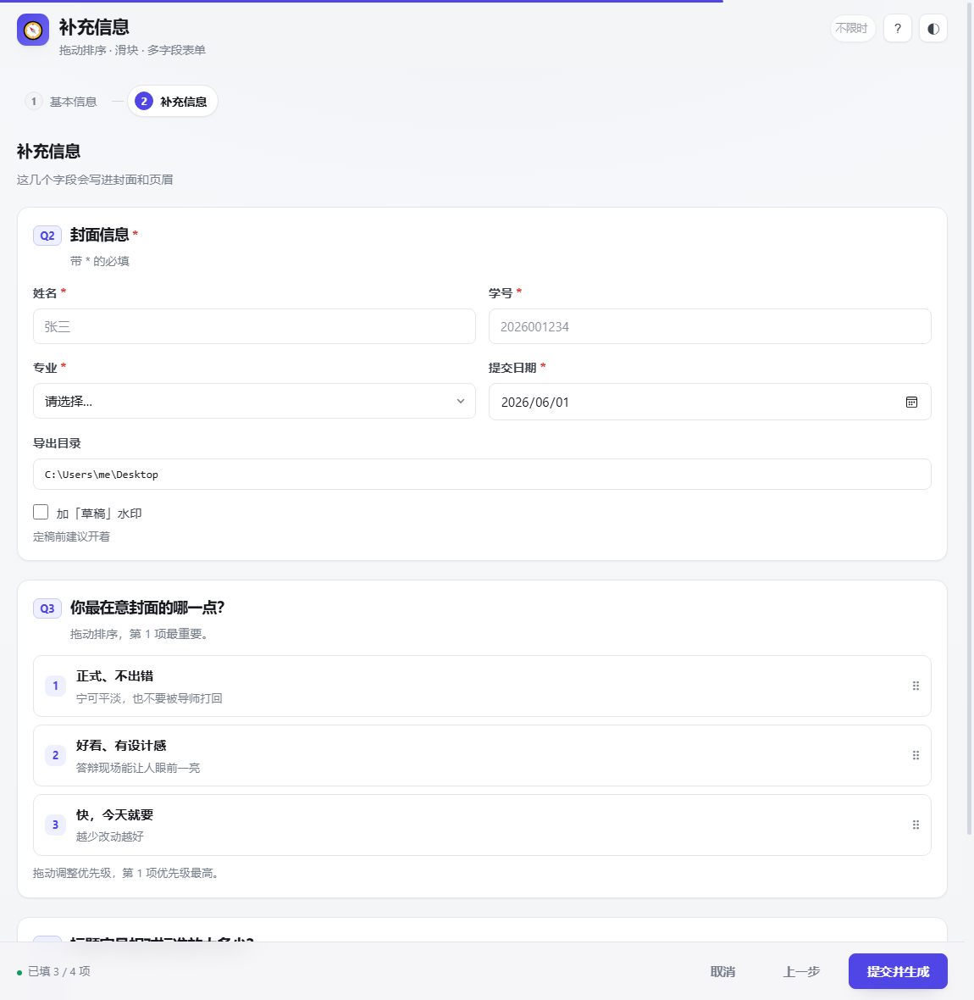
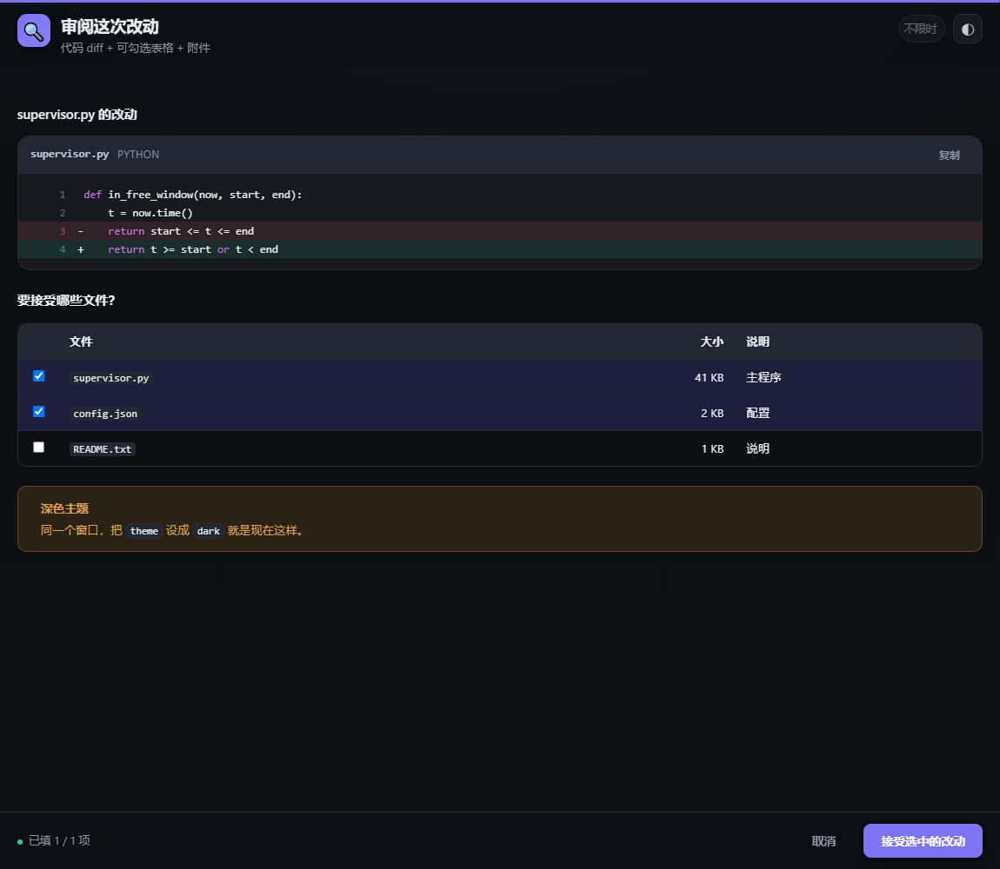

# ai-ask-detailed-needs

> **Give your AI a real window to ask you things.**
> An [opencode](https://opencode.ai) skill + custom tool that replaces the plain question box with a rich, local, zero-dependency interaction window — Markdown, image previews, option cards, forms, drag-to-rank, wizards, tables, code diffs and file previews. The user's answers come back as structured JSON.
>
> No Python. No Node. No runtime to install — it runs inside opencode itself.

面向 [opencode](https://opencode.ai) 的富交互询问技能：把 AI 那个「单调的询问框」换成一个**独立窗口**，能展示预览图、能对比方案、能填表、能走多步流程，用户提交后结构化 JSON 直接回到 AI 上下文里。


---

## 解决什么问题

AI 要问用户问题时，内置询问框只能给几行纯文字选项。一旦要**展示**什么，就彻底不够用了：

- 生成了 3 种风格的文档，想让人挑 —— 3 张预览图往哪放？
- 想让人**看**一段改动、一张表、一份 PDF —— 贴一屏文字没人看得下去
- 要一次收齐姓名、日期、路径、偏好 —— 只能来回问好几轮
- 流程有先后（先选方向，再补细节）—— 全塞一屏就是灾难

这个技能提供的是一个**本地渲染的交互窗口**，把这些一次讲清楚。



## 特性

| 能力 | 说明 |
| --- | --- |
| **Markdown 正文** | 标题、列表、表格、引用、围栏代码块、任务列表，离线自渲染 |
| **选项卡 + 图片预览** | 单选/多选、缩略图、点开灯箱放大、徽章、可折叠详情、补充说明 |
| **图片三种来源** | AI 现画的**内联 SVG**（不落盘）、本地文件路径、网络 URL |
| **表单** | 文本/多行/数字/下拉/多选/日期/时间/路径/开关/颜色，两栏布局、必填校验 |
| **拖动排序** | 直接拖拽调整优先级 |
| **滑块** | 连续量，带刻度与单位 |
| **表格** | 纯展示或可勾选（单选/多选） |
| **代码 / diff** | 行号、语法高亮、`+/-` 差异着色、一键复制 |
| **附件预览** | 本地 PNG / PDF（内嵌翻页）/ 源码 / 文本 / Markdown |
| **分步向导** | 2–4 页流程，步骤条可点击跳转，跨页校验 |
| **空闲超时** | 用户**完全没操作**才算超时；鼠标一动就重新计时，并带回已填内容 |
| **深浅主题** | 跟随系统，也可手动切换 |



## 安装

> 需要 [opencode](https://opencode.ai)。**不需要 Python、Node 或任何其它运行时** —— 窗口由 opencode 自带运行时提供，用系统已有的 Edge / Chrome 显示。

### Windows

```powershell
git clone https://github.com/LuYanghao-whaat/ai-ask-detailed-needs "$env:USERPROFILE\.config\opencode\skills\ai-ask-detailed-needs"
cd "$env:USERPROFILE\.config\opencode\skills\ai-ask-detailed-needs"
powershell -ExecutionPolicy Bypass -File .\install.ps1
```

> Windows 默认禁止运行 `.ps1` 脚本，所以上面用 `-ExecutionPolicy Bypass` 只对这一次调用放行，不改系统设置。

### macOS / Linux

```bash
git clone https://github.com/LuYanghao-whaat/ai-ask-detailed-needs ~/.config/opencode/skills/ai-ask-detailed-needs
cd ~/.config/opencode/skills/ai-ask-detailed-needs
bash install.sh
```

安装脚本做两件事：把技能放到 `<opencode 配置目录>/skills/`，把工具放到 `<opencode 配置目录>/tools/`。**装完重启 opencode**（技能和工具只在启动时加载）。

### 手动安装

把仓库放进配置目录，再把工具文件拷进 `tools/`：

```
<opencode 配置目录>/          # Windows: %USERPROFILE%\.config\opencode
├── skills/ai-ask-detailed-needs/   ← 整个仓库放这里
└── tools/ai-ask-detailed-needs.ts  ← 从仓库的 tools/ 拷过来
```

也可以只在**单个项目**里用：放进项目的 `.opencode/skills/` 和 `.opencode/tools/`。

### 卸载

```powershell
powershell -ExecutionPolicy Bypass -File .\install.ps1 -Uninstall   # Windows
```
```bash
bash install.sh --uninstall   # macOS / Linux
```

## 用法

装好后不用做任何事 —— 当 AI 判断内置询问框表达不下时（要展示预览图、对比方案、收集多个字段、走多步流程），会自己调用它，你的桌面就会弹出窗口。

也可以直接要求：

> 「给我 3 个封面方案，配上预览图让我选」
> 「做个表单让我填一下这些参数」
> 「分几步问清楚我的需求」

### 直接看界面长什么样

双击 `assets/ui.html`。没有 spec 时会自动进入**演示模式**，把所有块类型渲染一遍，不影响真实询问。

## spec 速查

```js
ai-ask-detailed-needs(
  title: "选一个论文封面风格",
  icon: "📄",
  intro: "我把你的题目套进去了，做了 3 个方案……",
  wide: true,
  timeoutSeconds: 1800,
  blocks: [
    { type: "choice", id: "cover", required: true, columns: 3,
      prompt: "你想要哪种封面？",
      options: [
        { id: "A", label: "极简居中", badge: "推荐", badgeTone: "acc",
          description: "留白多，导师最不容易挑毛病。",
          image: { kind: "svg", value: "<svg …>…</svg>" } }
      ] },
    { type: "text", id: "note", prompt: "还有什么要调整的？" }
  ]
)
```

块类型：`markdown` `note` `choice` `text` `form` `ranking` `slider` `table` `code` `attachment` `html` `divider`

完整字段说明见 **[references/spec.md](references/spec.md)**。

返回：

```json
{
  "status": "submitted",
  "answers": { "cover": "A", "note": "标题再大一点" },
  "partial": null,
  "unanswered": [],
  "elapsedMs": 8421,
  "idleTimedOut": false
}
```

`status` 有四种：`submitted` / `cancelled` / `timeout` / `error`。超时不会丢数据 —— 用户已填的部分会放在 `partial` 里。

## 工作原理

```
AI 调用工具
   └─ 在 127.0.0.1 随机端口起一个本地 HTTP 服务（带随机 token）
        └─ 探测 Edge / Chrome，用 --app 打开无边框窗口（没有就退回默认浏览器）
             └─ 页面是单个自包含 HTML，离线渲染，无任何外部请求
                  └─ 用户操作 → POST /api/submit
                       └─ 结构化 JSON 回到 AI 上下文
```

几个设计取舍：

- **跑在 opencode 自带运行时里**，所以目标机器零依赖。这是刻意选的：Python 方案在别人的电脑上跑不起来。
- **本地路径走白名单**：只有 spec 里出现过的文件才允许读取，其它一律 403。
- **所有请求校验随机 token**，且只监听 `127.0.0.1`。
- **界面是单个 HTML 文件**，内联 CSS/JS，不加载任何 CDN —— 离线可用，也不会有内容外泄。
- **超时是「空闲」超时**：只要用户还在动鼠标，窗口就不会超时。

## 兼容性

- **opencode**：必需。工具（`tools/*.ts`）是 opencode 的自定义工具机制。
- **浏览器**：Windows 上探测 Edge / Chrome（含 LocalAppData 安装）；macOS 上探测 Chrome / Edge / Brave / Chromium；Linux 上从 `PATH` 找。都没有就退回系统默认浏览器（普通标签页，不是无边框窗口）。
- **实测平台**：Windows 11 + Edge / Chrome。macOS 与 Linux 的代码路径已写好但未实测，欢迎反馈。

## 常见问题

**窗口没弹出来？**
工具会返回 `status: "error"` 和一条 `url`，把那个链接手动贴进浏览器即可。

**能离线用吗？**
可以。界面不加载任何外部资源。spec 里如果用 `{ kind: "url" }` 引用网络图片，那是你自己的选择。

**能给别人用吗？**
整个仓库拷过去 + 重启 opencode 就行。

## 许可

[MIT](LICENSE)
